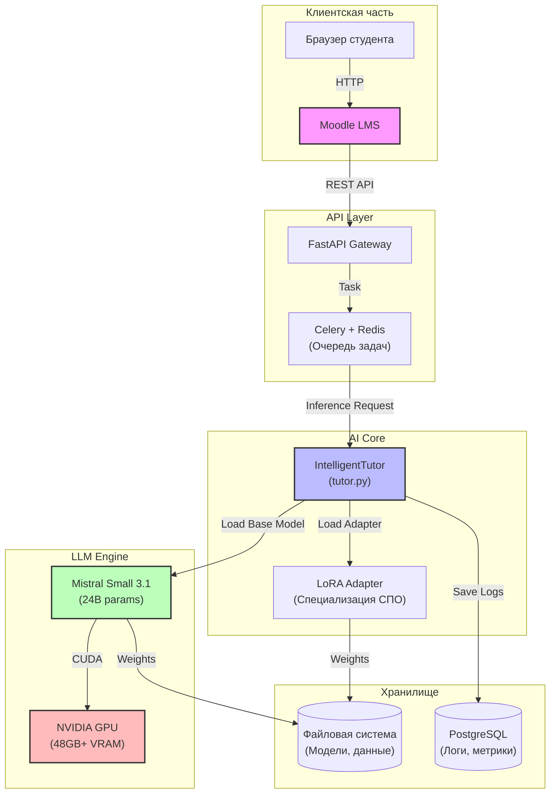

# Интеллектуальный тьютор на базе LLM для СПО


Система автоматизации учебного процесса для среднего профессионального образования (СПО) на основе открытых больших языковых моделей (LLM). Решение позволяет перераспределить учебную нагрузку, перенеся изучение теоретического материала на самостоятельную работу с поддержкой ИИ, а аудиторное время — на отработку практических навыков.

---

## 📋 Оглавление

- [Ключевые особенности](#-ключевые-особенности)
- [Архитектура системы](#-архитектура-системы)
- [Технологический стек](#-технологический-стек)
- [Быстрый старт](#-быстрый-старт)
- [Конфигурация](#-конфигурация)
- [Структура репозитория](#-структура-репозитория)
- [Статус реализации](#-статус-реализации)
- [Дорожная карта](#-дорожная-карта)
- [Участие в разработке](#-участие-в-разработке)
- [Команда](#-команда)
- [Лицензия](#-лицензия)

---

## 🚀 Ключевые особенности

- **Генерация многослойного контента**: Автоматическое создание структурированных конспектов (базовый/углубленный уровни) из лекций преподавателя, аудиоверсий, визуальных схем и заданий для самопроверки.
- **Интеграция с электронной образовательной средой**: Бесшовная интеграция с электронной образовательной средой (Moodle) через API.
- **Инклюзивность**: Адаптация контента для студентов с ограниченными возможностями здоровья (ОВЗ).
- **Безопасность данных**: Развертывание локальной модели (на собственном сервере техникума) гарантирует защиту персональных данных студентов.
- **Модульная архитектура**: Поддержка LoRA-адаптеров позволяет быстро адаптировать систему под различные специальности без переобучения базовой модели.

---

## 🏗 Архитектура системы



### Поток данных

1. **Студент** открывает курс в Moodle и нажимает «Создать конспект».
2. **Moodle** отправляет текст лекции через REST API на FastAPI Gateway.
3. **Gateway** ставит задачу в очередь Celery (для долгих запросов).
4. **IntelligentTutor** загружает модель и генерирует конспект.
5. **Результат** возвращается в Moodle и отображается студенту.

---

## 🛠 Технологический стек

### Языковая модель

| Компонент | Прототип | Продакшен |
|-----------|----------|-----------|
| Базовая модель | Mistral Small 3.1 (24B, Apache 2.0) | ИИ-Монолит (российская LLM) |
| Адаптеры | LoRA/QLoRA для специализации | Domain-specific LoRA |

### Программное обеспечение

| Категория | Технологии |
|-----------|------------|
| **Бэкенд** | Python 3.10+, PyTorch 2.0+ |
| **ML-фреймворки** | Transformers (Hugging Face), PEFT (LoRA/QLoRA), Accelerate |
| **API** | FastAPI, Celery, Redis |
| **Интеграция** | Moodle Web Services, REST API |
| **Безопасность** | Safetensors, On-premise deployment |

### Требования к оборудованию

| Параметр | Минимум | Рекомендуется |
|----------|---------|---------------|
| GPU VRAM | 48 GB | 80 GB (A100) |
| RAM | 64 GB | 128 GB |
| Storage | 100 GB SSD | 500 GB NVMe |
| CPU | 8 cores | 16+ cores |

---

## 🚀 Быстрый старт

### Предварительные требования

- Python 3.10 или выше
- CUDA 12.x совместимый GPU (для инференса на GPU)
- Минимум 48 GB VRAM для Mistral Small 24B

### Установка (Linux)

```bash
# 1. Клонирование репозитория
git clone https://git.qubu.ai/REDACTED_USERNAME/ml_model-intellektualniy-tyutor-na-osnove-otkrytykh-bolshikh-yazykovykh-modelei-dlya-spo.git
cd ml_model-intellektualniy-tyutor-na-osnove-otkrytykh-bolshikh-yazykovykh-modelei-dlya-spo

# 2. Установка Git LFS (для работы с большими файлами)
git lfs install

# 3. Создание виртуального окружения
python3 -m venv .venv
source .venv/bin/activate

# 4. Установка зависимостей
pip install --upgrade pip
pip install -r requirements.txt

# 5. Настройка переменных окружения
cp .env.example .env
# Отредактируйте .env под вашу конфигурацию

# 6. Запуск тьютора
python tutor.py
```

### Установка (Windows)

```powershell
# 1. Клонирование репозитория
git clone https://git.qubu.ai/REDACTED_USERNAME/ml_model-intellektualniy-tyutor-na-osnove-otkrytykh-bolshikh-yazykovykh-modelei-dlya-spo.git
cd ml_model-intellektualniy-tyutor-na-osnove-otkrytykh-bolshikh-yazykovykh-modelei-dlya-spo

# 2. Установка Git LFS
git lfs install

# 3. Создание виртуального окружения
python -m venv .venv
.\.venv\Scripts\activate

# 4. Установка зависимостей
pip install --upgrade pip
pip install -r requirements.txt

# 5. Настройка переменных окружения
copy .env.example .env
# Отредактируйте .env под вашу конфигурацию

# 6. Запуск тьютора
python tutor.py
```

### Установка с CUDA поддержкой

```bash
# Для GPU инференса установите PyTorch с CUDA
pip install torch --index-url https://download.pytorch.org/whl/cu121
pip install -r requirements.txt
```

### Docker (опционально)

```bash
# Сборка образа
docker build -t ai-tutor-spo:latest .

# Запуск контейнера
docker run --gpus all -p 8000:8000 ai-tutor-spo:latest
```

---

## ⚙️ Конфигурация

Основные параметры настраиваются через файл `.env`:

| Переменная | Описание | По умолчанию |
|------------|----------|--------------|
| `MODEL_PATH` | Путь к модели (HF ID или локальный) | `mistralai/Mistral-Small-24B-Instruct-2501` |
| `ADAPTER_PATH` | Путь к LoRA адаптерам | `None` |
| `HUGGINGFACE_TOKEN` | Токен HF для приватных моделей | — |
| `LOG_LEVEL` | Уровень логирования | `INFO` |
| `MAX_TOKENS` | Макс. токенов для генерации | `512` |
| `TEMPERATURE` | Температура сэмплирования | `0.7` |

---

## 📦 Структура репозитория

```
ml_model-intellektualniy-tyutor-na-osnove-otkrytykh-bolshikh-yazykovykh-modelei-dlya-spo/
├── tutor.py              # Основной модуль ИИ-тьютора
├── requirements.txt      # Зависимости Python
├── .env.example          # Пример конфигурации
├── .gitignore            # Исключения Git
├── test_tutor.py         # Unit-тесты
├── CHANGELOG.md          # История изменений
├── README.md             # Документация проекта
├── CHECKLIST.md          # Чек-лист проекта
└── docs/
    └── Qubu_AI_Tutor_Project.pdf  # Техническое задание
```

---

## 📅 Статус реализации

| Этап | Статус | Описание |
|------|--------|----------|
| Этап 1: Прототип | ✅ Завершён | Создание прототипа на базе Mistral |
| Этап 2: Инфраструктура | 🔄 В процессе | Закупка и подготовка серверного оборудования |
| Этап 3: Дообучение | ⏳ Планируется | Fine-tuning на датасете СИТ |
| Этап 4: Пилот | ⏳ Планируется | Внедрение в группе 15.02.14 |

---

## 🗺 Дорожная карта

### v0.3.0 — Q3 2024 (Планируется)
- [ ] Интеграция с Moodle через REST API
- [ ] Реализация веб-интерфейса для преподавателей
- [ ] Система логирования и аналитики использования
- [ ] Rate limiting и очередь задач (Celery)

### v0.4.0 — Q4 2024 (Планируется)
- [ ] Дообучение модели на датасете СИТ
- [ ] Загрузка LoRA-адаптеров в репозиторий
- [ ] Генерация тестов и заданий для самопроверки
- [ ] Мультиязычная поддержка (русский + английский)

### v0.5.0 — Q1 2025 (Планируется)
- [ ] Пилотное внедрение в учебный процесс
- [ ] Сбор обратной связи от студентов и преподавателей
- [ ] Оптимизация инференса (квантование, кэширование)
- [ ] Интеграция с ИИ-Монолит

### v1.0.0 — Q2 2025 (Планируется)
- [ ] Полноценный продакшен-релиз
- [ ] Документация API (OpenAPI/Swagger)
- [ ] Методические рекомендации для других СПО
- [ ] Публикация в открытом доступе под Apache 2.0

---

## 🤝 Участие в разработке

Мы приветствуем вклад в развитие проекта! Для участия:

1. Сделайте fork репозитория
2. Создайте ветку для вашей фичи (`git checkout -b feature/amazing-feature`)
3. Зафиксируйте изменения (`git commit -m 'Add amazing feature'`)
4. Отправьте в ветку (`git push origin feature/amazing-feature`)
5. Откройте Pull Request

Пожалуйста, убедитесь, что ваш код проходит все тесты:
```bash
pytest test_tutor.py -v
```

---

## 👥 Команда

| Участник | Роль |
|----------|------|
| **Бардаков Д.Н.** | Руководитель проекта, преподаватель высшей категории |
| **Мышанская Н.Г.** | Методист, преподаватель высшей категории |

**Организация:** ГБПОУ РО «Сальский индустриальный техникум» (СИТ)

---

## 📄 Лицензия

Данный проект распространяется под лицензией **Apache 2.0**. См. файл [LICENSE](LICENSE) для деталей.

---

## 📚 Полезные ссылки

- [Mistral AI Documentation](https://docs.mistral.ai/)
- [Hugging Face Transformers](https://huggingface.co/docs/transformers/)
- [PEFT Documentation](https://huggingface.co/docs/peft/)
- [Moodle Web Services](https://docs.moodle.org/dev/Web_services)
- [Репозиторий на Qubu](https://git.qubu.ai/REDACTED_USERNAME/ml_model-intellektualniy-tyutor-na-osnove-otkrytykh-bolshikh-yazykovykh-modelei-dlya-spo)

---

> 💡 **Примечание:** Проект находится в активной разработке. Некоторые функции могут быть недоступны или работать некорректно. Следите за обновлениями в [CHANGELOG.md](CHANGELOG.md).
