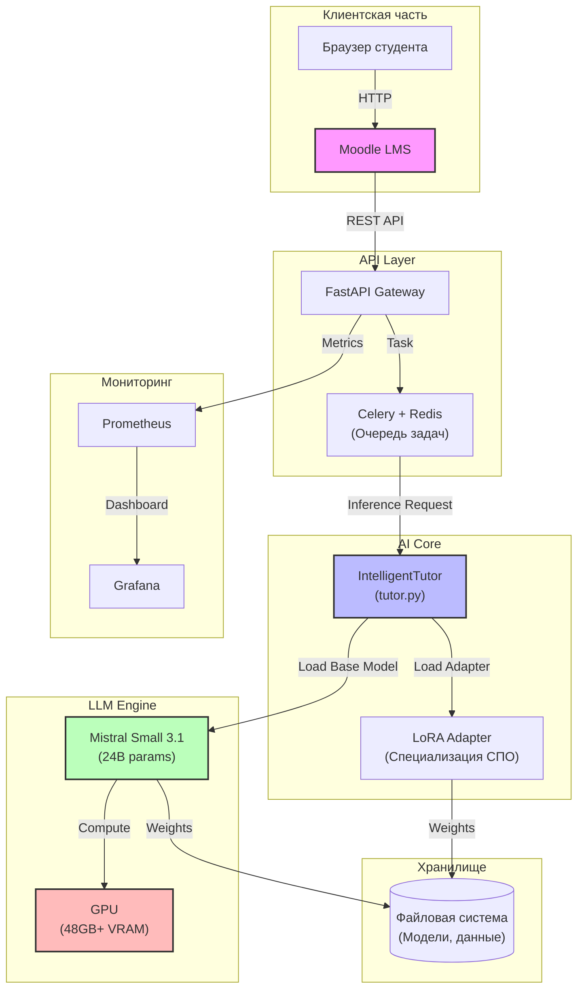

# Интеллектуальный тьютор на базе LLM для СПО


Система автоматизации учебного процесса для среднего профессионального образования (СПО) на основе открытых больших языковых моделей (LLM). Решение позволяет перераспределить учебную нагрузку, перенеся изучение теоретического материала на самостоятельную работу с поддержкой ИИ, а аудиторное время — на отработку практических навыков.

> **Проект:** 15.02.14 «Оснащение средствами автоматизации технологических процессов и производств»
> **Организация:** ГБПОУ РО «Сальский индустриальный техникум» (СИТ)

---

## Оглавление

- [Ключевые особенности](#-ключевые-особенности)
- [Архитектура системы](#-архитектура-системы)
- [Технологический стек](#-технологический-стек)
- [Быстрый старт](#-быстрый-старт)
- [Конфигурация](#-конфигурация)
- [Структура репозитория](#-структура-репозитория)
- [Статус реализации](#-статус-реализации)
- [Дорожная карта](#-дорожная-карта)
- [Команда](#-команда)
- [Лицензия](#-лицензия)

---

## 🚀 Ключевые особенности

- **Генерация конспектов**: Автоматическое создание структурированных конспектов из лекций преподавателя с выделением ключевых терминов и практических применений.
- **Генерация тестов**: Автоматическая генерация тестовых вопросов с вариантами ответов, правильными ответами и пояснениями. Уровни сложности: easy / medium / hard.
- **Диалоговый режим**: Чат с ИИ-тьютором для уточняющих вопросов по материалу лекции.
- **Интеграция с Moodle**: Бесшовная интеграция через блок «ИИ Тьютор» и Local Plugin с AJAX-вызовами к API.
- **Безопасность данных**: On-premise развёртывание (сервер в техникуме), данные не покидают периметр (ФЗ-152).
- **GPU-агностичность**: Поддержка любых GPU-ускорителей через PyTorch 2.0+ (CUDA, ROCm). Автоопределение GPU через `scripts/detect_gpu.sh`.
- **Модульная архитектура**: QLoRA-адаптеры позволяют адаптировать систему под различные специальности без переобучения базовой модели.
- **Асинхронная обработка**: Celery + Redis для долгих запросов (submit → poll → result).

---

## 🏗 Архитектура системы



### Поток данных

1. **Студент** открывает курс в Moodle и нажимает «Создать конспект» в блоке «ИИ Тьютор».
2. **Moodle** отправляет текст лекции через AJAX на FastAPI Gateway (`POST /api/v1/generate-summary`).
3. **Gateway** ставит задачу в очередь Celery (для долгих запросов используется async-паттерн: `POST /api/v1/async/generate-summary` → `GET /api/v1/async/status/{task_id}`).
4. **IntelligentTutor** загружает модель (singleton в Celery worker) и генерирует конспект.
5. **Результат** возвращается в Moodle и отображается в модальном окне.

---

## 🛠 Технологический стек

### Языковая модель

| Компонент | Текущий | Плановый |
|-----------|---------|----------|
| Базовая модель | Mistral Small 24B-Instruct (24B, Apache 2.0) | ИИ-Монолит (российская LLM) |
| Дообучение | QLoRA 4-bit (NF4, bfloat16) | Domain-specific LoRA |
| Целевые задачи | Конспекты, тесты, чат, объяснения | + аудио, видео |

### Программное обеспечение

| Категория | Технологии |
|-----------|------------|
| **Модель / ML** | PyTorch 2.0+, Transformers, PEFT (QLoRA), BitsAndBytes, TRL (SFTTrainer), Accelerate |
| **API** | FastAPI, Uvicorn, Celery, Redis, Pydantic Settings |
| **Интеграция** | Moodle Local Plugin, Moodle Block, REST API, AJAX |
| **Контейнеризация** | Docker (multi-stage), Docker Compose (production + dev overlay) |
| **Мониторинг** | Prometheus, Grafana (6 панелей) |
| **Безопасность** | Safetensors, On-premise, UFW, Fail2Ban, SSH hardening |

### Требования к оборудованию

| Параметр | Минимум | Рекомендуется |
|----------|---------|---------------|
| GPU VRAM | 48 GB | 80 GB |
| RAM | 64 GB | 256 GB |
| Storage | 100 GB SSD | 2 TB NVMe |
| CPU | 8 cores | 32 cores |

---

## 🚀 Быстрый старт

### Вариант 1: Docker (рекомендуется)

```bash
# 1. Клонирование репозитория
git clone https://github.com/DimaNikolaevi4/al.git
cd al

# 2. Настройка переменных окружения
cp .env.example .env
# Отредактируйте .env: MODEL_PATH, HUGGINGFACE_TOKEN (токен для скачивания модели)

# 3. Запуск через Docker Compose
docker compose up -d

# 4. Проверка
curl http://localhost:8000/api/v1/health
```

Docker Compose запускает три сервиса:
- `api` — FastAPI сервер (порт 8000)
- `celery-worker` — обработчик асинхронных задач
- `redis` — брокер очередей (порт 6379)

### Вариант 2: Ручная установка (Linux)

```bash
# 1. Клонирование репозитория
git clone https://github.com/DimaNikolaevi4/al.git
cd al

# 2. Создание виртуального окружения
python3 -m venv .venv
source .venv/bin/activate

# 3. Установка зависимостей
pip install --upgrade pip
pip install -r requirements.txt

# 4. Настройка переменных окружения
cp .env.example .env

# 5. Запуск Redis (требуется для Celery)
docker run -d --name redis -p 6379:6379 redis:7-alpine

# 6. Запуск API сервера
uvicorn api.main:app --host 0.0.0.0 --port 8000

# 7. Запуск Celery worker (в другом терминале)
celery -A api.celery_app worker --loglevel=info
```

### Вариант 3: Дообучение модели (требует GPU)

```bash
# 1. Определить GPU
bash scripts/detect_gpu.sh

# 2. Тестовый запуск (10 шагов)
python train.py --mode debug

# 3. Полное обучение (3 эпохи)
python train.py --mode full

# 4. Оценка качества
python evaluate.py --checkpoint ./checkpoints/best
```

Подробные инструкции по установке драйверов: [`docs/setup_nvidia.md`](docs/setup_nvidia.md) и [`docs/setup_amd.md`](docs/setup_amd.md).

---

## ⚙️ Конфигурация

Основные параметры настраиваются через файл `.env` (см. [`.env.example`](.env.example)):

### Модель

| Переменная | Описание | По умолчанию |
|------------|----------|--------------|
| `MODEL_PATH` | Путь к модели (ID модели или локальный) | `mistralai/Mistral-Small-24B-Instruct-2501` |
| `ADAPTER_PATH` | Путь к QLoRA адаптерам | пусто (базовая модель) |
| `HUGGINGFACE_TOKEN` | Токен для скачивания моделей (переменная окружения библиотеки) | — |
| `MAX_TOKENS` | Макс. токенов для генерации | `2048` |
| `TEMPERATURE` | Температура сэмплирования | `0.7` |

### API сервер

| Переменная | Описание | По умолчанию |
|------------|----------|--------------|
| `API_HOST` | Хост API | `0.0.0.0` |
| `API_PORT` | Порт API | `8000` |
| `REDIS_URL` | URL брокера Celery | `redis://localhost:6379/0` |
| `CORS_ORIGINS` | Разрешённые источники CORS | `http://localhost:3000` |
| `SECRET_KEY` | Ключ аутентификации API | — |

### Moodle

| Переменная | Описание | По умолчанию |
|------------|----------|--------------|
| `MOODLE_URL` | URL сайта Moodle | — |
| `MOODLE_TOKEN` | Токен Web Service Moodle | — |
| `AITUTOR_API_URL` | URL API ИИ-тьютора (из Moodle) | `http://localhost:8000` |

---

## 📦 Структура репозитория

```
al/
├── api/                          # FastAPI сервер
│   ├── main.py                   #   Приложение (lifespan, CORS, degraded mode)
│   ├── config.py                 #   Pydantic Settings (.env)
│   ├── models.py                 #   12 Pydantic-схем
│   ├── celery_app.py             #   Celery + singleton-модель
│   ├── tasks.py                  #   Утилиты async-задач
│   └── routes/                   #   Эндпоинты
│       ├── generate.py           #     Sync: summary, test, chat
│       ├── async_generate.py     #     Async: submit + status
│       └── system.py             #     Health, info, stats
├── moodle/                       # Moodle-плагин
│   ├── docs/README_MOODLE.md     #   Документация интеграции
│   └── local/aitutor/            #   Local Plugin
│       ├── version.php, settings.php, ajax.php
│       ├── classes/service.php
│       ├── db/                   #     install.xml, access.php
│       ├── amd/src/              #     JS-модуль
│       ├── lang/ru/, lang/en/    #     Локализация
│       └── block_aitutor/        #     Блок «ИИ Тьютор»
├── monitoring/                   # Prometheus + Grafana
│   ├── prometheus.yml
│   └── grafana_dashboards/       #   6 панелей мониторинга
├── scripts/                      # Скрипты автоматизации
│   ├── harden_server.sh          #   Базовый hardening (idempotent)
│   ├── detect_gpu.sh             #   Автоопределение GPU (CUDA/ROCm)
│   ├── deploy.sh                 #   Деплой приложения + smoke test
│   ├── deploy_dataset.sh         #   Деплой датасета + валидация
│   ├── smoke_test.py             #   Smoke test API
│   ├── backup.sh                 #   Бэкап адаптеров и логов
│   └── validate_annotations.py   #   Валидация разметки датасета
├── dataset/                      # Датасет для дообучения
│   ├── data/                     #   train.jsonl, val.jsonl, test.jsonl (771 запись)
│   └── raw/                      #   67 лекций (40 ПА + 27 ИС)
├── docs/                         # Документация и черновики
│   ├── draft_student_instruction.md
│   ├── draft_teacher_instruction.md
│   ├── draft_seminar_plan.md
│   ├── draft_methodology_recommendations.md
│   ├── draft_journal_article.md
│   ├── roi_calculation.md
│   ├── gold_standard_guidelines.md
│   ├── setup_nvidia.md / setup_amd.md
│   └── ...                       #   Полный список в CHECKLIST.md
├── train.py                      # Скрипт дообучения (SFTTrainer, QLoRA)
├── evaluate.py                   # Оценка качества генерации
├── lora_config.py                # Конфигурация QLoRA (3 пресета)
├── data_collator.py              # SFT Data Collator
├── tutor.py                      # Основной модуль ИИ-тьютора
├── Dockerfile                    # Multi-stage Docker-образ
├── docker-compose.yml            # Production: api + celery + redis
├── docker-compose.dev.yml        # Dev-overlay с hot-reload
├── requirements.txt
├── .env.example
├── CHECKLIST.md                  # Чеклист проекта (117 задач, 57%)
└── CHANGELOG.md
```

---

## 📅 Статус реализации

| Этап | Статус | Описание |
|------|--------|----------|
| M1: Прототип | ✅ Завершён | Базовая работа модели, генерация конспектов |
| M2: Инфраструктура | 🔶 В процессе | Закупка сервера (ожидается Q2 2026) |
| M3: Дообучение | 🔶 В процессе | Датасет v2.0 готов (771 запись). Скрипты готовы. Ожидает GPU |
| M4: Пилот | ❌ Не начат | Q4 2026 — внедрение в группе 15.02.14 |
| M5: Продакшен | ❌ Не начат | Q1 2027 — полноценный релиз |

**Прогресс:** 67 / 117 задач (57%). Подробности в [`CHECKLIST.md`](CHECKLIST.md).

### Что уже сделано

- ✅ FastAPI сервер с 10 эндпоинтами (sync + async + system)
- ✅ Celery + Redis для асинхронной обработки
- ✅ Moodle-плагин (Local Plugin + Block «ИИ Тьютор»)
- ✅ QLoRA конфигурация + SFTTrainer (3 режима: debug/light/full)
- ✅ Docker + Docker Compose (production + dev)
- ✅ Мониторинг Prometheus + Grafana (6 панелей)
- ✅ Датасет: 67 лекций → 771 JSONL запись (train/val/test)
- ✅ Инфраструктурные скрипты: hardening, detect GPU, deploy, backup
- ✅ Документация: инструкции, соглашения, методрекомендации, ROI

### Что заблокировано (требует сервер)

- 🔒 Раздел 6: всё дообучение (14 задач)
- 🔒 Раздел 7.2: эксплуатация пилота (5 задач)

---

## 🗺 Дорожная карта

### v0.2.0 — 2026-04-25 ✅

- ✅ Production-ready качество кода, логирование, обработка ошибок
- ✅ Unit-тесты, `.env` конфигурация

### v0.3.0 — 2026-05-06 ✅

- ✅ FastAPI сервер с degraded mode и lifespan
- ✅ Celery + Redis (async: submit → poll → result)
- ✅ Moodle Local Plugin + Block «ИИ Тьютор»
- ✅ QLoRA конфигурация + SFTTrainer (`train.py`)
- ✅ Data Collator с chat-template и маскированием prompt
- ✅ Docker + Docker Compose (production + dev)
- ✅ Prometheus + Grafana мониторинг
- ✅ Инфраструктурные скрипты (harden, detect GPU, deploy, backup)
- ✅ Датасет v2.0 (67 лекций, 771 JSONL, 2 дисциплины)

### v0.4.0 — Q3 2026 (Планируется)

- [ ] Дообучение модели на датасете СИТ (ожидает GPU)
- [ ] Gold Standard (50 примеров ручной разметки)
- [ ] Валидация качества (автоматическая + ручная)
- [ ] Мержинг QLoRA-адаптеров в базовую модель
- [ ] Оптимизация инференса (квантование INT8/INT4)

### v0.5.0 — Q4 2026 (Планируется)

- [ ] Пилотное внедрение в учебный процесс (группа 15.02.14)
- [ ] Семинар для педагогов
- [ ] Сбор обратной связи от студентов
- [ ] Сравнение результатов аттестаций с прошлым годом
- [ ] Хотфикс критических багов

### v1.0.0 — Q1 2027 (Планируется)

- [ ] Полноценный продакшен-релиз
- [ ] Публикация статьи в профессиональном журнале
- [ ] Методические рекомендации для других техникумов
- [ ] Распространение кода под Apache 2.0
- [ ] Планирование обновления до ИИ-Монолит
- [ ] Голосовой интерфейс

---

## 👥 Команда

| Участник | Роль |
|----------|------|
| **Бардаков Д.Н.** | Руководитель проекта, архитектор, ML-инженер |
| **Мышанская Н.Г.** | Методист, контент, датасет |

**Организация:** ГБПОУ РО «Сальский индустриальный техникум» (СИТ)

---

## 📄 Лицензия

Данный проект распространяется под лицензией **Apache 2.0**.

---

## 📚 Полезные ссылки

- [Mistral AI Documentation](https://docs.mistral.ai/)
- [Transformers Documentation](https://huggingface.co/docs/transformers/)
- [PEFT Documentation (QLoRA)](https://huggingface.co/docs/peft/)
- [TRL Documentation (SFTTrainer)](https://huggingface.co/docs/trl/)
- [FastAPI Documentation](https://fastapi.tiangolo.com/)
- [Moodle Web Services](https://docs.moodle.org/dev/Web_services)
- [Репозиторий на Qubu](https://git.qubu.ai/REDACTED_USERNAME/ml_model-intellektualniy-tyutor-na-osnove-otkrytykh-bolshikh-yazykovykh-modelei-dlya-spo)
- [Репозиторий на GitHub](https://github.com/DimaNikolaevi4/al)

---

> 💡 Проект находится в активной разработке. Прогресс: **57% (67/117 задач)**. Следите за обновлениями в [`CHECKLIST.md`](CHECKLIST.md) и [`CHANGELOG.md`](CHANGELOG.md).
