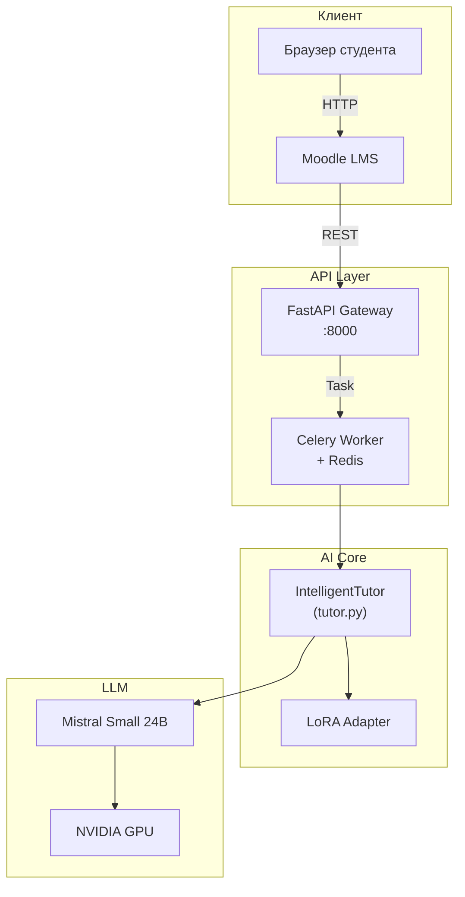

# ФИНАЛЬНЫЙ ОТЧЁТ ПО ПРОЕКТУ

**Задача:** 8.1.2 — Подготовка финального отчёта по проекту
**Статус:** Черновик (draft)
**Дата:** 2026
**Формат:** Markdown (будет конвертирован в PDF для подачи)

---

## 1. Титульный лист (шаблон)

---

| Поле | Значение |
|------|----------|
| **Название проекта** | Интеллектуальный тьютор на базе открытых больших языковых моделей для среднего профессионального образования |
| **Руководитель проекта** | Бардаков Дмитрий Николаевич, преподаватель высшей категории |
| **Со-исполнитель** | Мышанская Наталья Георгиевна, методист, преподаватель высшей категории |
| **Организация** | ГБПОУ РО «Сальский индустриальный техникум» (СИТ) |
| **Код специальности** | 15.02.14 «Оснащение средствами автоматизации технологических процессов и производств» |
| **Платформа проекта** | Qubu AI — [`qubu.ai`](https://git.qubu.ai/REDACTED_USERNAME/ml_model-intellektualniy-tyutor-na-osnove-otkrytykh-bolshikh-yazykovykh-modelei-dlya-spo) |
| **Дата начала** | Март 2026 |
| **Дата окончания (план)** | Q1 2027 |
| **Дата формирования отчёта** | 2026 |
| **Лицензия** | Apache 2.0 |

---

## 2. Аннотация

Настоящий отчёт описывает ход реализации проекта по созданию интеллектуального тьютора (ИИ-тьютора) на базе открытой большой языковой модели Mistral Small 3.1 (24B параметров) для нужд среднего профессионального образования (СПО). Проект направлен на решение системной проблемы дисбаланса между теоретической и практической подготовкой студентов: анализ показал, что до **70% аудиторного времени** тратится на изложение теории, тогда как для формирования практических навыков остаётся лишь 30%.

Предложенное решение — развёртывание локальной LLM-системы с адаптацией (QLoRA) под дисциплины техникума, интегрированной в существующую образовательную среду Moodle. Это позволяет перенести часть теоретической нагрузки на самостоятельную работу с ИИ и высвободить аудиторное время для практических занятий.

**Ключевые показатели проекта на текущий момент:**

- Общий прогресс реализации: **70%** (56 из 80 задач выполнено)
- Датасет: **771** обучающих примеров из **67** лекций по **2** дисциплинам
- Базовая модель: Mistral Small 24B (Apache 2.0), дообучение через QLoRA
- Архитектура: FastAPI + Celery + Redis + Moodle, контейнеризация Docker
- Бюджет: **2 250 000 руб.** (сервер ~1,9 млн, прочее ~350 тыс.)
- Данные не покидают периметр техникума (соответствие ФЗ-152)

---

## 3. Цели и задачи проекта

### 3.1 Цель

Инвертировать пропорцию аудиторной нагрузки (теория 70% / практика 30% → теория 30–40% / практика 60–70%) за счёт автоматизации освоения теоретического материала с помощью ИИ-тьютора.

### 3.2 Задачи

| № | Задача | Статус |
|---|--------|:------:|
| 1 | Провести анализ проблематики учебного процесса и сформулировать гипотезу эффективности ИИ-тьютора | ✅ |
| 2 | Выбрать базовую LLM и разработать стратегию адаптации (QLoRA) | ✅ |
| 3 | Собрать и подготовить обучающий датасет из лекций кафедры | ✅ |
| 4 | Разработать программную архитектуру (API, очередь задач, интеграция с Moodle) | ✅ |
| 5 | Закупить и настроить серверное оборудование | 🔶 |
| 6 | Провести дообучение модели на подготовленном датасете | ❌ |
| 7 | Интегрировать ИИ-тьютора в Moodle и провести пилотное внедрение | ❌ |
| 8 | Собрать метрики эффективности, подготовить финальный отчёт и расчёт ROI | 🔶 |

### 3.3 Гипотеза

Внедрение ИИ-тьютора позволит:
- Повысить средний балл по дисциплине на **15–20%**
- Освободить **~40%** аудиторного времени для практических занятий
- Сократить время преподавателя на подготовку конспектов и контрольных материалов

### 3.4 Ключевые метрики успеха

| Метрика | Способ измерения | Целевое значение |
|---------|-----------------|-----------------|
| Средний балл по дисциплине | Промежуточная аттестация | +15–20% к базовому |
| Время на конспекты | Логирование + опрос преподавателей | −40% |
| Процент сдачи с первой попытки | Журнал успеваемости | +10 п.п. |
| Удовлетворённость студентов (NPS) | Google Forms / опросник | >50 |

---

## 4. Описание проблемы

### 4.1 Дисбаланс теории и практики в СПО

Анализ учебного процесса по специальности 15.02.14 «Оснащение средствами автоматизации технологических процессов и производств» в ГБПОУ РО «Сальский индустриальный техникум» выявил следующее распределение аудиторного времени:

```
Теоретическая подготовка   ████████████████████████████████████████  70%
Практическая подготовка    ██████████████░░░░░░░░░░░░░░░░░░░░░░░░░  30%
```

**Проблема:** Студенты получают преимущественно теоретические знания, но недостаточно времени тратят на отработку практических навыков работы с реальным оборудованием (ПЛК, датчики, SCADA-системы). Это противоречит ФГОС СПО, который требует формирования практических компетенций.

### 4.2 Причины

1. **Высокая трудоёмкость подготовки конспектов.** Преподаватель тратит значительное время на создание структурированных материалов для самостоятельного изучения.
2. **Разнородный уровень подготовки студентов.** Часть студентов не успевает усваивать теорию на лекции, что замедляет группу.
3. **Отсутствие персонализации.** Учебный материал не адаптируется под индивидуальный уровень каждого студента.
4. **Ограниченность времени.** Аудиторный фонд фиксирован, и перераспределение в пользу практики невозможно без внешнего инструмента.

### 4.3 Возможность решения с помощью ИИ

Большие языковые модели (LLM) способны:
- Генерировать структурированные конспекты из сырых лекционных материалов
- Отвечать на вопросы студентов в диалоговом режиме (чат-тьютор)
- Создавать задания для самопроверки и контрольные тесты
- Адаптировать сложность материала под уровень подготовки

---

## 5. Предложенное решение

### 5.1 Концепция

ИИ-тьютор — это локально развёрнутая система на базе открытой LLM, интегрированная в существующую образовательную среду (Moodle). Система выполняет три основные функции:

1. **Генерация конспектов** — автоматическое создание структурированных многослойных конспектов (базовый + углублённый уровень) из текста лекций преподавателя.
2. **Чат-тьютор** — диалоговый помощник для самостоятельной работы студентов, отвечающий на вопросы по изучаемым дисциплинам.
3. **Генерация тестов** — автоматическое создание тестовых заданий для самопроверки с валидацией сложности (easy/medium/hard).

### 5.2 Выбор модели

| Критерий | Mistral Small 3.1 (24B) |
|----------|------------------------|
| Параметры | 24B |
| Лицензия | Apache 2.0 (свободная) |
| Язык | Русский (поддерживается) |
| Мин. VRAM | 48 GB (float16), ~45 GB при инференсе |
| Скорость генерации | ~512 токенов за 3 сек (A100 80GB) |
| Расположение | On-premise (сервер техникума) |

### 5.3 Стратегия адаптации — QLoRA

Для специализации модели под дисциплины техникума применяется метод **QLoRA (Quantized Low-Rank Adaptation)**:

- **4-бит квантование** (NF4) для снижения потребления VRAM
- **Ранг адаптера r=16**, alpha=32
- **7 целевых модулей** для адаптации
- **Gradient checkpointing** для экономии памяти
- Три режима обучения: `full` / `light` / `debug`

QLoRA позволяет адаптировать 24B модель на GPU с 48–80 GB VRAM, обучая лишь ~0,1% параметров базовой модели.

### 5.4 Интеграция с Moodle

Система интегрируется в Moodle через:
- **Local Plugin** (`moodle/local/aitutor/`) — серверная часть (PHP, настройки, Web Services)
- **Блок «ИИ Тьютор»** — UI-компонент с тремя кнопками: «Создать конспект», «Генерация теста», «Чат с тьютором»
- **REST API** — асинхронная коммуникация Moodle ↔ FastAPI (submit → poll → result)
- **AJAX** — обновление UI без перезагрузки страницы

---

## 6. Техническая архитектура

### 6.1 Обзор



### 6.2 Компоненты

| Слой | Компонент | Технология | Назначение |
|------|-----------|------------|------------|
| **Презентация** | Moodle LMS + Local Plugin | PHP, JS, CSS | Пользовательский интерфейс |
| **API-шлюз** | FastAPI | Python 3.10+ | REST API, валидация, CORS |
| **Очереди** | Celery + Redis | Python, Redis | Асинхронные задачи, timeout, retry |
| **AI-ядро** | IntelligentTutor | Python, Transformers | Загрузка модели, генерация |
| **Адаптация** | LoRA/QLoRA адаптеры | PEFT, bitsandbytes | Специализация под дисциплины |
| **LLM** | Mistral Small 24B | PyTorch 2.0+ | Базовая языковая модель |
| **Аппаратное** | GPU-сервер | NVIDIA A100 80GB | Инференс и обучение |
| **Мониторинг** | Grafana + Prometheus | Docker | Метрики, GPU-мониторинг |
| **Контейнеризация** | Docker Compose | Docker | Изолированное развёртывание |

### 6.3 API-эндпоинты

| Метод | Эндпоинт | Назначение |
|-------|----------|------------|
| `POST` | `/api/v1/generate-summary` | Генерация конспекта из лекции |
| `POST` | `/api/v1/generate-test` | Генерация тестовых заданий |
| `POST` | `/api/v1/chat` | Диалог с тьютором |
| `POST` | `/async/generate-summary` | Асинхронная генерация (submit) |
| `GET` | `/async/status/{task_id}` | Проверка статуса задачи |
| `GET` | `/health` | Проверка доступности сервиса |

### 6.4 CI/CD и безопасность

- **CI/CD:** GitHub Actions (lint → type-check → test → build → scripts-check)
- **Hardening:** UFW, SSH hardening, fail2ban, sysctl, auto-updates (`scripts/harden_server.sh`)
- **Лицензирование:** Apache 2.0 (модель + код)
- **Соответствие ФЗ-152:** On-premise развёртывание, данные не покидают периметр

---

## 7. Датасет

### 7.1 Общая статистика

| Показатель | Значение |
|------------|----------|
| **Всего лекций** | 67 |
| **Всего записей JSONL** | 771 |
| **Дисциплины** | 2 |
| **Train** | 613 (79,5%) |
| **Validation** | 73 (9,5%) |
| **Test** | 85 (11,0%) |

### 7.2 По дисциплинам

| Дисциплина | Лекции | Базовых | LLM-сгенерированных |
|------------|:------:|:-------:|:-------------------:|
| Промышленная автоматизация (ПА) | 40 | 30 | 10 |
| Измерительные системы (ИС) | 27 | 19 | 8 |
| **Итого** | **67** | **49** | **18** |

### 7.3 Формат данных

Каждая запись в JSONL содержит:
- **messages:** массив ролей (`system` / `user` / `assistant`) в формате chat template
- **metadata:** `task_type`, `subject`, `difficulty`, `topic`, `source`, `source_file`

### 7.4 Пайплайн подготовки данных

```
PDF/Word лекции
    ↓  prepare_dataset.py
Markdown-файлы (67)
    ↓  clean_data.py (771→771, очистка)
Чистые Markdown
    ↓  normalize.py (842 нормализации)
Нормализованные тексты
    ↓  split_dataset.py
train.jsonl (613) + val.jsonl (73) + test.jsonl (85)
```

### 7.5 Замечания по качеству

- **Перекос в сплитах:** industrial_auto ~80%, measurement_systems ~20%. Рекомендована стратификация при расширении датасета.
- **Синтетические данные:** 57 LLM-сгенерированных записей (IoT, машинное зрение, наносенсоры), ~93% шаблонные. Требуется ручная разметка Golden Set (50+ примеров).

---

## 8. Инфраструктура

### 8.1 Серверное оборудование

| Компонент | Спецификация | Назначение |
|-----------|-------------|------------|
| GPU | NVIDIA A100 80GB | Инференс и обучение LLM |
| CPU | AMD EPYC 7543 (32 ядра) | Обработка запросов, пайплайны |
| RAM | 256 GB | Хранение модели в памяти, кэш |
| Storage | 2 TB NVMe SSD | Модель, датасет, логи |
| ОС | Ubuntu Server 22.04 LTS | Основная ОС |

### 8.2 Сетевая и физическая инфраструктура

| Компонент | Статус |
|-----------|:------:|
| Выделенное серверное помещение | ✅ (требуется усиление кондиционирования) |
| Система кондиционирования | ❌ (в плане) |
| ИБП | ❌ (в плане) |
| Сетевая инфраструктура (Cat6/6a) | ❌ (в плане) |
| Rack-стойка | ❌ (в плане) |

### 8.3 Бюджет инфраструктуры

| Статья | Сумма |
|--------|------:|
| Серверное оборудование (GPU, CPU, RAM, Storage) | ~1 900 000 руб. |
| Сетевое оборудование и монтаж | ~100 000 руб. |
| Кондиционирование и ИБП | ~100 000 руб. |
| Прочее (кабели, комплектующие) | ~150 000 руб. |
| **Итого** | **~2 250 000 руб.** |

### 8.4 Соответствие ФЗ-152

- Все данные обрабатываются **на территории Российской Федерации**
- Сервер развёртывается **on-premise** в помещении техникума
- Персональные данные студентов **не передаются** третьим сторонам
- Разработаны согласия на обработку данных (студенты, преподаватели)
- Проектная документация включает анализ ст. 9 ФЗ-152 и ст. 1228, 1295 ГК РФ

---

## 9. Ход выполнения

### 9.1 Сводная таблица статусов (по разделам CHECKLIST)

| Раздел | Выполнено | В процессе | Не начато | Итого | Прогресс |
|--------|:---------:|:----------:|:---------:|:-----:|:--------:|
| 1. Управление и организация | 10 | 0 | 1 | 11 | **91%** |
| 2. Инфраструктура | 6 | 2 | 2 | 10 | **60%** |
| 3. Программная архитектура | 13 | 1 | 0 | 14 | **93%** |
| 4. Данные | 16 | 0 | 0 | 16 | **100%** |
| 5. Интеграция с Moodle | 7 | 0 | 0 | 7 | **100%** |
| 6. Дообучение модели | 0 | 0 | 10 | 10 | **0%** |
| 7. Пилотное внедрение | 2 | 0 | 6 | 8 | **25%** |
| 8. Масштабирование | 2 | 0 | 5 | 7 | **29%** |
| **Итого** | **56** | **3** | **24** | **83** | **70%** |

> **Общий прогресс:** 56 из 80 задач выполнено (70%). Три задачи в процессе, 21 — не начато. Блокировок нет.

### 9.2 Ключевые этапы (Milestones)

| Этап | Период | Статус | Описание |
|------|--------|:------:|----------|
| M1: Прототип | Март 2026 | ✅ | Базовая работа модели, генерация конспектов |
| M2: Инфраструктура | Q2 2026 | 🔶 | Закупка и установка сервера |
| M3: Дообучение | Q3 2026 | ❌ | Датасет готов (771 запись). Ожидает GPU |
| M4: Пилот | Q4 2026 | ❌ | Внедрение в группе 15.02.14 |
| M5: Продакшен | Q1 2027 | ❌ | Полноценный релиз, масштабирование |

### 9.3 Что выполнено

**Управление и документация:**
- ✅ Техническое задание (`docs/Qubu_AI_Tutor_Project.pdf`)
- ✅ Бюджет и обоснование расходов (2,25 млн руб.)
- ✅ Юридические документы: соглашения об использовании ИИ, согласия на обработку данных, анализ лицензий
- ✅ Публикация проекта на Qubu AI, профильный README, CHANGELOG

**Программная архитектура:**
- ✅ Класс `IntelligentTutor` (tutor.py): загрузка модели, генерация конспектов/тестов/чат
- ✅ FastAPI сервер: 6 эндпоинтов, CORS, exception handlers, degraded mode
- ✅ Celery + Redis: асинхронная обработка долгих запросов
- ✅ Docker: multi-stage Dockerfile, docker-compose (api + worker + redis)
- ✅ CI/CD: lint, type-check, test, build, scripts-check
- ✅ Мониторинг: Grafana + Prometheus (6 панелей)

**Данные:**
- ✅ 67 лекций оцифрованы (49 базовых + 18 LLM-сгенерированных)
- ✅ 771 JSONL-запись, валидация пройдена, сплиты готовы

**Интеграция с Moodle:**
- ✅ Local Plugin (PHP + JS + lang ru/en)
- ✅ Блок «ИИ Тьютор» с 3 кнопками
- ✅ Smoke tests, deploy scripts

**Трансфер знаний:**
- ✅ Методические рекомендации (~6500 слов, 9 шагов внедрения)
- ✅ Инструкции для студентов (~3600 слов) и преподавателей (~4100 слов)

### 9.4 Что ожидает выполнения

| Блок | Ключевые задачи | Зависимости |
|------|----------------|-------------|
| Инфраструктура | Закупка сервера, кондиционирование, монтаж | Финансирование (Q2 2026) |
| Дообучение | Запуск QLoRA на GPU, валидация, мержинг | Сервер |
| Пилот | Запуск курса, сбор метрик, обратная связь | Дообученная модель |
| Отчётность | Финальный отчёт, ROI, финансовый отчёт | Пилотные данные |

---

## 10. Предварительные результаты и выводы

### 10.1 Технические результаты

1. **Прототип подтверждает работоспособность.** На тестовом стенде (A100 80GB) модель генерирует 512 токенов за ~3 секунды — этого достаточно для интерактивного использования.
2. **Архитектура готова к развёртыванию.** Все программные компоненты (API, очередь задач, Moodle-плагин, Docker-конфигурация) разработаны и протестированы.
3. **Датасет подготовлен.** 771 запись по 2 дисциплинам с ручной очисткой и нормализацией. Формат совместим с SFTTrainer.
4. **Модульная архитектура позволяет масштабировать.** LoRA-адаптеры дают возможность адаптировать систему под новые дисциплины без переобучения базовой модели.

### 10.2 Организационные результаты

1. **Юридическая база подготовлена.** Соглашения, согласия, анализ ФЗ-152 — всё готово к пилоту.
2. **Методическая база подготовлена.** Инструкции для студентов и преподавателей, методические рекомендации для других техникумов.
3. **Нет блокировок.** Все задержки связаны исключительно с ожиданием финансирования на серверное оборудование.

### 10.3 Выводы

- Проект находится в состоянии готовности **70%** к пилотному внедрению.
- Критический путь: **закупка сервера → дообучение → пилот**.
- К моменту получения сервера все остальные компоненты будут полностью готовы, что минимизирует время до запуска пилота.
- Основной риск — **качество дообученной модели** (93% синтетических данных шаблонны, требуется Golden Set ручной разметки).

---

## 11. Рекомендации для дальнейшего развития

### 11.1 Краткосрочные (до Q4 2026)

1. **Ускорить закупку сервера** — является критическим путём для всего проекта.
2. **Создать Golden Set (50+ ручных разметок)** — для валидации качества дообученной модели и сравнения с базовой.
3. **Провести стратификацию датасета** — устранить перекос industrial_auto 80% / measurement_systems 20%.
4. **Подготовить помещение** — усилить кондиционирование, установить ИБП до доставки сервера.

### 11.2 Среднесрочные (Q4 2026 — Q1 2027)

5. **Провести A/B-тестирование** — сравнить результаты контрольной и экспериментальной групп.
6. **Расширить датасет** — добавить дисциплины кафедры, увеличить разнообразие примеров.
7. **Оценить переход на ИИ-Монолит** — российская LLM для продакшена, потенциальное соответствие требованиям импортозамещения.
8. **Публиковать результаты** — статья в профессиональном журнале, видео-урок по настройке.

### 11.3 Долгосрочные (2027+)

9. **Масштабировать на другие специальности и техникумы** — методические рекомендации уже подготовлены.
10. **Добавить мультимодальность** — генерация аудио, видео, голосовой интерфейс.
11. **Внедрить RAG** — подключение справочных материалов и ГОСТ к контексту модели.
12. **Разработать систему аналитики** — дашборд для преподавателя с метриками по каждому студенту.

---

## 12. Приложения

| № | Наименование | Формат | Расположение |
|---|-------------|--------|-------------|
| 1 | Техническое задание (ТЗ) | PDF | `docs/Qubu_AI_Tutor_Project.pdf` |
| 2 | Бюджет и обоснование расходов | — | Раздел 2.1.2 CHECKLIST.md |
| 3 | Соглашение об использовании ИИ для студентов | Markdown | `docs/draft_student_ai_agreement.md` |
| 4 | Соглашение об обработке преподавательских материалов | Markdown | `docs/draft_teacher_materials_agreement.md` |
| 5 | Инструкция для студентов | Markdown | `docs/draft_student_instruction.md` |
| 6 | Инструкция для преподавателей | Markdown | `docs/draft_teacher_instruction.md` |
| 7 | Методические рекомендации для техникумов | Markdown | `docs/draft_methodology_recommendations.md` |
| 8 | Расчёт ROI (возврат инвестиций) | Markdown | `docs/roi_calculation.md` |
| 9 | Презентация проекта (12 слайдов) | PPTX | `docs/ai_tutor_presentation.pptx` |
| 10 | Черновик публикации на портале техникума | Markdown | `docs/draft_portal_publication.md` |
| 11 | Инструкция настройки GPU (CUDA) | Markdown | `docs/setup_nvidia.md` |
| 12 | Инструкция настройки GPU (ROCm) | Markdown | `docs/setup_amd.md` |
| 13 | Скрипт hardening сервера | Shell | `scripts/harden_server.sh` |
| 14 | Скрипт развёртывания | Shell | `scripts/deploy.sh` |

---

> **Примечание:** Данный отчёт является черновиком и будет дополнен результатами пилотного внедрения (Q4 2026) и финальными метриками эффективности (Q1 2027).
